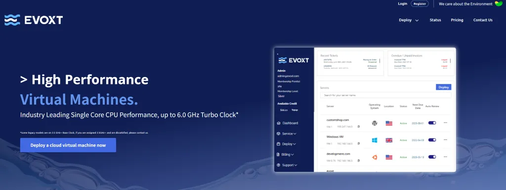

# 2026 年高性能 VPS 服务器 Evoxt 优惠码整理汇总

Evoxt 虽然是 2020 年成立的，但凭借高性能硬件配置和相对亲民的价格，这两年还是吸引了不少用户。

下面先简单介绍一下这家服务商的基本情况。

## Evoxt 服务商介绍

Evoxt 是一家成立于 2020 年的 VPS 主机服务商，主要提供基于 KVM 虚拟化技术的高性能云服务器。他们的数据中心分布在全球多个地区，采用的都是 AMD EPYC 处理器和 NVMe SSD 存储，硬件配置在同价位产品中算是比较扎实的。

这家服务商的特点是专注做高性能 VPS，虽然他们提供的套餐类型不算特别多，但每一款的配置都比较均衡，没有那种明显短板的感觉。而且最低套餐起步价仅 **$2.99/月**，对于预算有限的用户来说门槛不算高。

**访问 Evoxt 官网：** [https://evoxt.com](https://console.evoxt.com/aff.php?aff=1780)

从实际使用体验来看，Evoxt 的服务器不仅 CPU 性能极强，其 I/O 性能也很出色，跑数据库或者需要频繁读写的应用都比较流畅。后台控制面板也做得挺简洁，重装系统、查看监控数据这些操作都很方便。

**Evoxt 主要优势特点：**

- 高 CPU 主频提供出色的单核性能，最高可达 **6.0 GHz**
- 提供**免费每周备份**服务，数据安全有保障
- 采用 AMD EPYC 处理器 + NVMe SSD，性能配置扎实
- 透明定价，无任何隐藏费用
- 提供 DDoS 防护（例如美国地区提供 150 Gbps 防护），安全有保障
- 全球提供多个数据中心选择，网络质量稳定

而且客服响应速度也还可以，工单一般几个小时内就能得到回复。支持的付款方式也多种多样，支持支付宝、信用卡、PayPal、加密货币等主流方式，国内用户购买也没有障碍。

## Evoxt 优惠码整理

目前 Evoxt 可用的优惠码不算多，但还是能帮大家省下一些费用。下面整理了目前我了解到的 Evoxt 优惠码。

- **AFF1780-VPSZHIJIA**（长期有效）：折扣力度为 5%。虽然折扣不算特别高，但所有套餐都能使用。
- **EVOXT595**（已过期）：可以享受 40% 的循环折扣，适用于 VM-1 及以上套餐。

[点击访问 Evoxt 官网查看最新的优惠活动](https://console.evoxt.com/aff.php?aff=1780)

需要提醒的是，VPS 优惠码通常都有时效性，可能随时会失效或者被新的优惠活动替代。

## Evoxt 套餐配置详情

Evoxt 的套餐分为两类：**标准网络**和**高级网络**（Premium Network）。

标准网络覆盖范围更广，大多数机房都采用标准网络；高级网络支持的机房很少，虽然流量配额较少，但线路质量更佳，稳定性和性能表现更优。而且所有机房统一配备 1 Gigabit 端口。

需要注意的是，Evoxt 的产品卖得相当好，特别是热门机房经常会出现缺货的情况。如果看中了某个配置和机房，建议尽早下单，否则可能要等补货。香港、日本这些亚洲机房更是抢手，碰到有货的时候别犹豫。

### 标准网络套餐配置

标准网络覆盖的机房比较多，包括美国、英国、加拿大、德国、波兰、阿姆斯特丹、日本东京、马来西亚、澳大利亚、苏黎世、印度尼西亚和首尔等地区。

| 套餐名称 | CPU 核心 | 内存 | 存储空间 | 月流量 | 备份服务 | 价格 | 购买链接 |
|---------|---------|------|---------|--------|---------|------| --- |
| VM-0.5 | 1 核心 (最高 6.0 GHz) | 512 MB | 5 GB | 500 GB | 每周备份 | $2.99/月 | [立即购买](https://console.evoxt.com/aff.php?aff=1780) |
| VM-0.75 | 1 核心 (最高 6.0 GHz) | 1 GB | 10 GB | 750 GB | 每周备份 | $4.99/月 | [立即购买](https://console.evoxt.com/aff.php?aff=1780) |
| VM-1 | 1 核心 (最高 6.0 GHz) | 2 GB | 20 GB | 1000 GB | 每周备份 | $5.99/月 | [立即购买](https://console.evoxt.com/aff.php?aff=1780) |
| VM-1.5 | 2 核心 (最高 6.0 GHz) | 2 GB | 20 GB | 1500 GB | 每周备份 | $6.95/月 | [立即购买](https://console.evoxt.com/aff.php?aff=1780) |
| VM-2 | 2 核心 (最高 6.0 GHz) | 4 GB | 30 GB | 2000 GB | 每周备份 | $11.99/月 | [立即购买](https://console.evoxt.com/aff.php?aff=1780) |
| VM-3 | 4 核心 (最高 6.0 GHz) | 4 GB | 30 GB | 3000 GB | 每周备份 | $14.99/月 | [立即购买](https://console.evoxt.com/aff.php?aff=1780) |
| VM-4 | 4 核心 (最高 6.0 GHz) | 8 GB | 60 GB | 4000 GB | 每周备份 | $23.99/月 | [立即购买](https://console.evoxt.com/aff.php?aff=1780) |
| VM-6 | 8 核心 (最高 6.0 GHz) | 8 GB | 60 GB | 5000 GB | 每周备份 | $29.99/月 | [立即购买](https://console.evoxt.com/aff.php?aff=1780) |
| VM-8 | 8 核心 (最高 6.0 GHz) | 16 GB | 80 GB | 6000 GB | 每周备份 | $47.99/月 | [立即购买](https://console.evoxt.com/aff.php?aff=1780) |
| VM-12 | 16 核心 (最高 6.0 GHz) | 16 GB | 80 GB | 8000 GB | 每周备份 | $60.95/月 | [立即购买](https://console.evoxt.com/aff.php?aff=1780) |
| VM-16 | 16 核心 (最高 6.0 GHz) | 32 GB | 100 GB | 10 TB | 每周备份 | $95.99/月 | [立即购买](https://console.evoxt.com/aff.php?aff=1780) |

### 高级网络套餐配置

适用于香港、日本大阪和马来西亚高级线路。

| 套餐名称 | CPU 核心 | 内存 | 存储空间 | 月流量 | 备份服务 | 价格 | 购买链接 |
|---------|---------|------|---------|--------|---------|------| --- |
| VM-0.5 | 1 核心 (最高 6.0 GHz) | 512 MB | 5 GB | 250 GB | 每周备份 | $2.99/月 | [立即购买](https://console.evoxt.com/aff.php?aff=1780) |
| VM-0.75 | 1 核心 (最高 6.0 GHz) | 1 GB | 10 GB | 250 GB | 每周备份 | $4.99/月 | [立即购买](https://console.evoxt.com/aff.php?aff=1780) |
| VM-1 | 1 核心 (最高 6.0 GHz) | 2 GB | 20 GB | 500 GB | 每周备份 | $5.99/月 | [立即购买](https://console.evoxt.com/aff.php?aff=1780) |
| VM-1.5 | 2 核心 (最高 6.0 GHz) | 2 GB | 20 GB | 500 GB | 每周备份 | $6.95/月 | [立即购买](https://console.evoxt.com/aff.php?aff=1780) |
| VM-2 | 2 核心 (最高 6.0 GHz) | 4 GB | 30 GB | 1000 GB | 每周备份 | $11.99/月 | [立即购买](https://console.evoxt.com/aff.php?aff=1780) |
| VM-3 | 4 核心 (最高 6.0 GHz) | 4 GB | 30 GB | 1000 GB | 每周备份 | $14.99/月 | [立即购买](https://console.evoxt.com/aff.php?aff=1780) |
| VM-4 | 4 核心 (最高 6.0 GHz) | 8 GB | 60 GB | 2000 GB | 每周备份 | $23.99/月 | [立即购买](https://console.evoxt.com/aff.php?aff=1780) |
| VM-6 | 8 核心 (最高 6.0 GHz) | 8 GB | 60 GB | 2000 GB | 每周备份 | $29.99/月 | [立即购买](https://console.evoxt.com/aff.php?aff=1780) |
| VM-8 | 8 核心 (最高 6.0 GHz) | 16 GB | 80 GB | 3000 GB | 每周备份 | $47.99/月 | [立即购买](https://console.evoxt.com/aff.php?aff=1780) |
| VM-12 | 16 核心 (最高 6.0 GHz) | 16 GB | 80 GB | 3000 GB | 每周备份 | $60.95/月 | [立即购买](https://console.evoxt.com/aff.php?aff=1780) |
| VM-16 | 16 核心 (最高 6.0 GHz) | 32 GB | 100 GB | 5000 GB | 每周备份 | $95.99/月 | [立即购买](https://console.evoxt.com/aff.php?aff=1780) |

### 可选升级项目

如果基础套餐配置不够用，Evoxt 还提供了灵活的升级选项，可以根据实际需求单独增加资源。

| 升级项目 | 价格 | 订购方式 |
|---------|------|---------|
| 额外 IP 地址 | $3/月/个 | 需要在 Evoxt 单独订购 |
| 额外 CPU 核心 | $3/月/核 | VM 控制面板 > 升级选项卡 |
| 额外内存 | $2/月/GB | VM 控制面板 > 升级选项卡 |
| 额外月流量 | $3/月/TB（标准网络） $12/月/TB（高级网络） | VM 控制面板 > 升级选项卡 |
| 付费备份计划 | 根据存储大小定价 | VM 控制面板 > 升级选项卡 |

从价格来看，Evoxt 的升级费用还算合理，特别是内存和 CPU 的单价不高。如果项目发展起来需要更多资源，直接在控制面板升级就行，不用重新购买新服务器迁移数据。

## Evoxt 性能实测数据

很多人选 VPS 的时候光看配置参数，其实真正的性能表现才是关键。毕竟配置写得再漂亮，跑不动也白搭。下面分享一些 Evoxt 的实测数据，让大家对它的性能有个直观的了解。

### CPU 性能测试

使用 sysbench 对 Evoxt 的 VPS 进行 CPU 性能测试，结果相当亮眼。测试得到的 **events per second 达到 5645.25**，这个数据可以说是我见过最高的 VPS 了，比 [Vultr](https://www.vultr.com/?ref=9622724)、[搬瓦工](https://bwh81.net/aff.php?aff=75629)这些知名商家都还要更高。

这个成绩主要得益于 Evoxt 采用的高主频 CPU，最高可以跑到 6.0 GHz，因此 Evoxt 的 CPU 表现强劲。

### 磁盘 I/O 性能测试

磁盘性能方面的表现同样出色。实测数据显示：

- **随机 IOPS 达到 16.3K**
- **顺序读写速度高达 1.7 GB/s**

这个 I/O 性能也是顶尖水平，市面上能达到这个标准的商家不多，而且价格基本都比 Evoxt 贵。NVMe SSD 的优势在这里体现得淋漓尽致，跑数据库、缓存服务器或者需要频繁读写的应用，完全不用担心磁盘会成为瓶颈。

从这些测试数据来看，Evoxt 在 CPU 和磁盘性能上确实没有虚标，性价比相当突出。如果你的项目对性能有比较高的要求，但又不想花太多预算，Evoxt 是个非常合适的选择。

### 用户评价反馈

除了实测数据，其他用户的真实评价也很有参考价值。从各个渠道收集到的反馈来看，Evoxt 的口碑整体还不错。

大部分用户对 Evoxt 的性能和稳定性都比较认可，特别是 **CPU 主频高、磁盘速度快**这两点被提到的频率最高。也有用户表示他们的网络质量不错，延迟控制得比较好，跑网站或者代理服务都挺稳定的。

当然也有一些需要改进的地方。比如有用户反映热门机房经常缺货，想买的时候买不到；还有就是高级网络的流量比较紧张，如果跑流量大的业务可能需要额外购买流量包。不过这些都不是大问题，总体来说瑕不掩瑜。

---

如果你想了解更详细的用户评价和深度测评：[点击查看更多](https://console.evoxt.com/aff.php?aff=1780)